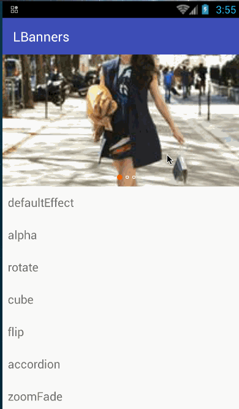

---
# BannerView
-------------


#### Banners示例:  



#### 引导页示例：


### 特性（可选）
- 链式调用
- 支持设置为Guide模式或者Banners模式（Guide模式记得将宽高比例设置为全屏）
- 支持是否循环播放
- 支持是否自动播放
- 支持页面切换间隔时间
- 支持两页动画过渡时间
- 支持自定义原点的样式
- 支持自定义原点大小（设置的宽度即为高度）
- 支持多种动画过渡方式
- 支持自定义动画过渡方式
- 支持原点位置底部居中或者底部居右
- 支持横向纵向播放（纵向暂只支持一种动画过渡）
- 支持设置原点距离底部的距离


### 原理说明
项目基于ViewPager实现,ViewPager使用方式不用多说。

需求1：如何循环播放？

实现方式采用假设当前Pager总页数为X，假设页数为Y页,
首次进入处于0页,向右滑动自然没问题，向左滑时候0------1,显然不成立,此时可在finshUpdate函数中手动将第0页的下标变为X,如此我们的
ViewPager即可向左滑动.但是当向右的时候呢?原理一样,当下标为X的时候，将其替换为0即可。

需求2:如何自动播放？

其实这对于稍微有点经验的人来说不算难点了,方式很多。本项目采用handler的方式,每次切换进行一次发送即可,在页面切换时记得Stop,回来
继续Start,页面销毁时进行Remove即可。

需求3：手指按住或者拖动时如何停止滑动。

本项目采用在ViewPager的dispatch进行事件分发的拦截处理。 当然也可以手动去处理Image的Ontouch事件。


### Gradle引与使用
Gradle:  


### 使用方法
Config in xml:
``` xml
 <cn.zgy.banner.BannerView
            android:id="@+id/banners"
            android:layout_width="match_parent"
            android:layout_height="match_parent"
            app:canLoop="true"
            app:isVertical="false"
            app:auto_play="true"
            app:durtion="5000"
            app:scroll_duration="66666"
            app:indicator_select="@drawable/page_indicator_select"
            app:indicator_unselect="@drawable/page_indicator_unselect"
            app:horizontal_transitionEffect="accordion"
            app:indicator_position="bottom_mid"
             app:indicator_width="5"
            >
        </ccn.zgy.banner.BannerView>
```
Config in Java:  
``` xml
 bannerView.setLayoutParams(new LinearLayout.LayoutParams(LinearLayout.LayoutParams.MATCH_PARENT, LinearLayout.LayoutParams.MATCH_PARENT));
         bannerView.isGuide(true)
                 .setAutoPlay(false)
                 .setCanLoop(false)
                 .setScrollDurtion(800)
                 .setIndicatorBottomPadding(30)
                 .setIndicatorWidth(10)
                 .setHoriZontalTransitionEffect(TransitionEffect.Cube)
                 .setIndicatorPosition(BannerView.IndicaTorPosition.BOTTOM_MID)
                 .setOnStartListener(R.drawable.button_shape,0XFFAACCBB,new BannerView.onStartListener() {
                     @Override
                     public void startOpen() {
                         //回调跳转的逻辑
                         startActivity(new Intent(GuideActivity.this,MainActivity.class));
                         Toast.makeText(GuideActivity.this, "进入Banners", Toast.LENGTH_SHORT).show();
                     }
                 })
                 .setAdapter(new BannerAdapter(GuideActivity.this), localImages)
         ;
     }
        //停止事件,节省资源
         @Override
    protected void onPause() {
        super.onPause();
        bannerView.stopImageTimerTask();
    }

    @Override
    protected void onResume() {
        super.onResume();
        bannerView.startImageTimerTask();
    }

    @Override
    protected void onDestroy() {
        super.onDestroy();
        bannerView.clearImageTimerTask();
    }
    
    /-------------Adapter-----------/
     @Override
    public View getView(final BannerView bannerView, final Context context, int position, String data) {
        View view = LayoutInflater.from(mContext).inflate(R.layout.item, null);
        ImageView imageView = (ImageView) view.findViewById(R.id.id_image);
        //可行选择喜欢的图片加载库。
        ImageLoader.getInstance().displayImage(data,imageView);

        imageView.setOnClickListener(new View.OnClickListener() {
            @Override
            public void onClick(View v) {

            }
        });
        return view;
    }
```


### 注意事项
-  纵向播放时暂只支持一种效果（后续可能增加）
-  使用纵向播放后代码不要设置setHoriZontalTransitionEffect（）、setHoriZontalCustomTransformer（）, XML内不要调用自定义属性horizontal_transitionEffect
 XML内不要调用自定义属性horizontal_transitionEffect
-  若setIndicatorBottomPadding（）动态代码自定义了原点距离底部的距离，需要在setIndicatorWidth()之前调用
### TODO
 XML内不要调用自定义属性horizontal_transitionEffect

